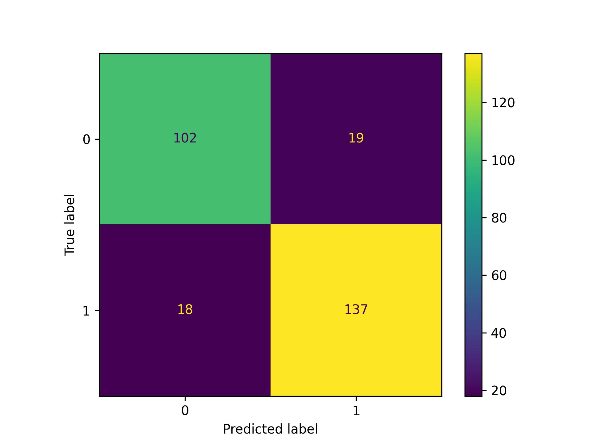
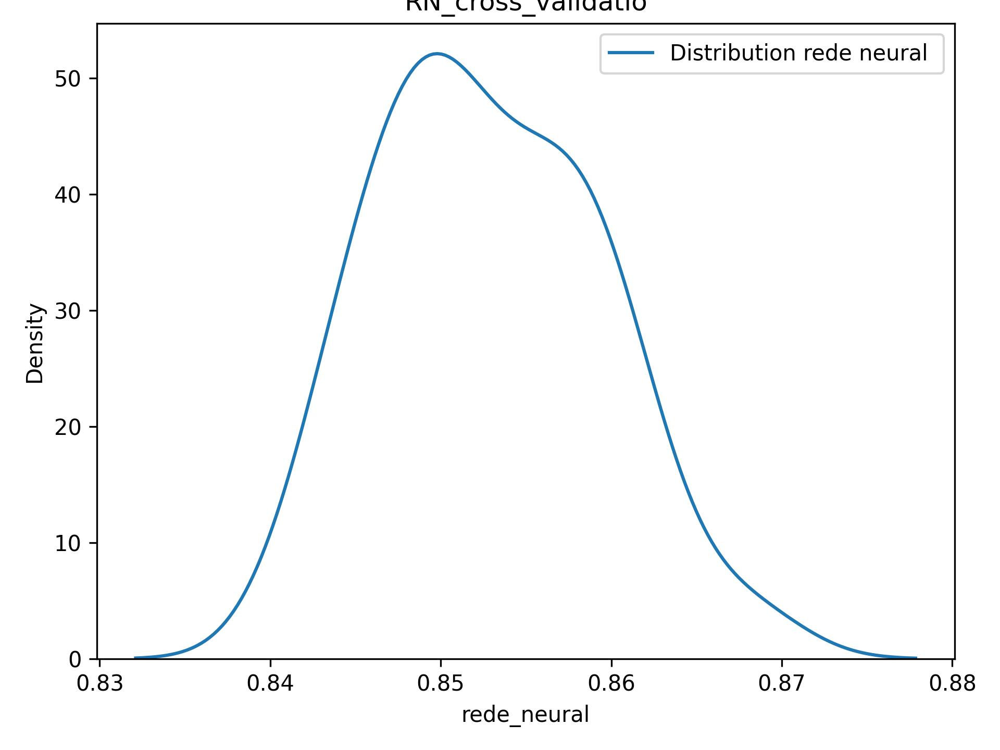

## Project Heart Diseaset
1. **About Dataset**

    This data set dates from 1988 and consists of four databases: Cleveland, Hungary, Switzerland, and Long Beach V. It contains 76 attributes, including the predicted attribute, but all published experiments refer to using a subset of 14 of them. The "target" field refers to the presence of heart disease in the patient. It is integer valued 0 = no disease and 1 = disease.
2. **Content/Attribute Information**
  * age
  * sex
  * chest pain type (4 values)
  * resting blood pressure
  * serum cholestoral in mg/dl
  * fasting blood sugar > 120 mg/dl
  * resting electrocardiographic results (values 0,1,2)
  * maximum heart rate achieved
  * exercise induced angina
  * oldpeak = ST depression induced by exercise relative to rest
 * the slope of the peak exercise ST segment 
 * number of major vessels (0-3)  colored by flourosopy thal:
    *  0 = normal; 
    *  1 = fixed defect;
    *  2 = reversable defect

3.1 **Neural_network (MLPClassifier)**

rede_neural  =**MLPClassifier**(hidden_layer_sizes=(14,14),
                            activation="logistic", solver ="adam"  , max_iter = 2000,
                            tol = 0.0001,random_state=0,verbose =True )

### **classification_repor**
|precision  |  recall | f1-score |  support|
|-----------------|---------|----------|---------|        
| 0  |     0.85  |    0.84  |    0.85   |    121   |   
| 1  |     0.88  |    0.88   |   0.88   |    155   |   
|**accuracy** |                |   | 0.87   |     276   |   
|**macro avg**   |    0.86  |    0.86    |  0.86  |     276   |   
|**weighted avg**   |    0.87  |    0.87    |   0.87  |     276 |

3.2 **Confusion Matrix** 

3.3 **Distribuition accuracy**
